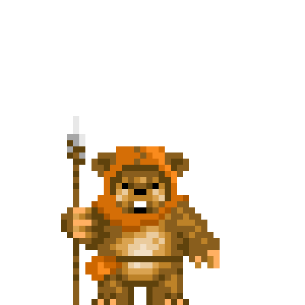

# Hello there! ... General Kenobi! 

### 🤓 Introduction
I am a Machine-learning engineer specialized in NLP and CV. I am huge cloud enthusiast! Doing my best to stay competetive and eager to learn new stuff. For me programming is just a tool for executing my high-level ideas. 
After hours I make YouTube videos 🎥, personal projects and of course run and train road-cycling in the Swiss Alps 🚴‍♀️🏃‍♂️

### 👨‍🔬 My expertize
- Natural Language Processing (Machine translation 🇰🇷🇩🇪, Text generation, Chatbots, Multi Label Classification for text)
- Computer Vision (CNNs, Image Classification problems, GANs, Unsupervised Anomaly Detection, Image & video processing 🏙📸 )
- Operating sytems and cloud 🐧

### 🧰 Languages and Tools

<code></code>
<code></code>
<code></code>
<code></code>
<code></code>
<code></code>
<code></code>
<code></code>
<code></code>
<!-- <code></code>
 -->
### 🌐 My very own piece of the internet 

- Check out my Website: [https://szymonrucinski.pl](https://szymonrucinski.pl)
- Visit my YouTube channel: [https://ruchopornikow.pl](https://ruchopornikow.pl)

### 📫 How to reach me:

 
