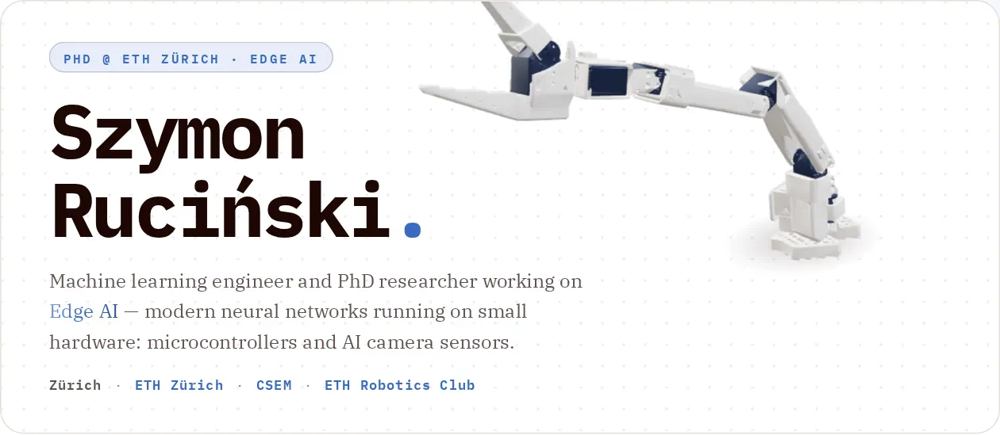
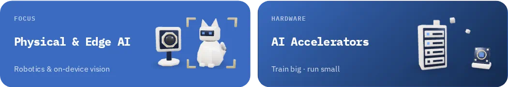
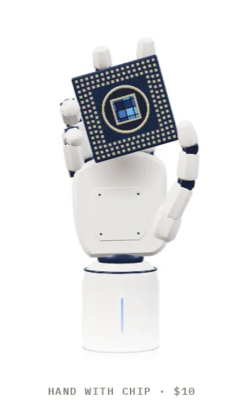

<a href="https://rucinski.ai">
  <picture>
    <source media="(prefers-color-scheme: dark)" srcset="./assets/hero-dark.webp" />
    <source media="(prefers-color-scheme: light)" srcset="./assets/hero-light.webp" />
    
  </picture>
</a>

<a href="https://rucinski.ai">
  <picture>
    <source media="(prefers-color-scheme: dark)" srcset="./assets/bento-dark.webp" />
    <source media="(prefers-color-scheme: light)" srcset="./assets/bento-light.webp" />
    
  </picture>
</a>

 

<picture>
  <source media="(prefers-color-scheme: dark)" srcset="./assets/hand-dark.webp" />
  <source media="(prefers-color-scheme: light)" srcset="./assets/hand-light.webp" />
  
</picture>

### `00 /` I run neural networks on a ~~datacenter~~ *$10 chip.*

PhD researcher at [ETH Zürich (D-ITET)](https://ee.ethz.ch/) & [CSEM](https://www.csem.ch) ([SwissChips](https://swisschips.ethz.ch/)) — compressing vision transformers and world models from HPC clusters down to microcontrollers, AI camera sensors, and robots.

- **NeurIPS 2026** · **FTerViT** — Fully Ternary Vision Transformer ([paper](https://arxiv.org/abs/2605.21171) · [live demo](https://szymonrucinski-ftervit.static.hf.space) · [write-up](https://rucinski.ai/blog/ftervit-ternary-vision-transformer))
- **Robot learning** · world models & embedded perception at [ETH Robotics Club](https://www.ethrobotics.ch/)
- **Open models** · [krakowiak-7b](https://huggingface.co/szymonrucinski/krakowiak-7b) (Polish LLM) · [Skryba-v1](https://huggingface.co/szymonrucinski/Skryba-v1) (1.5B ASR) · [AiRoll](https://szymonrucinski-airoll.static.hf.space)

[rucinski.ai](https://rucinski.ai) · [Hugging Face](https://huggingface.co/szymonrucinski) · [Google Scholar](https://scholar.google.com/citations?user=FvGSOtcAAAAJ) · [LinkedIn](https://www.linkedin.com/in/szymon-ruciński-a87b92182/)

 
